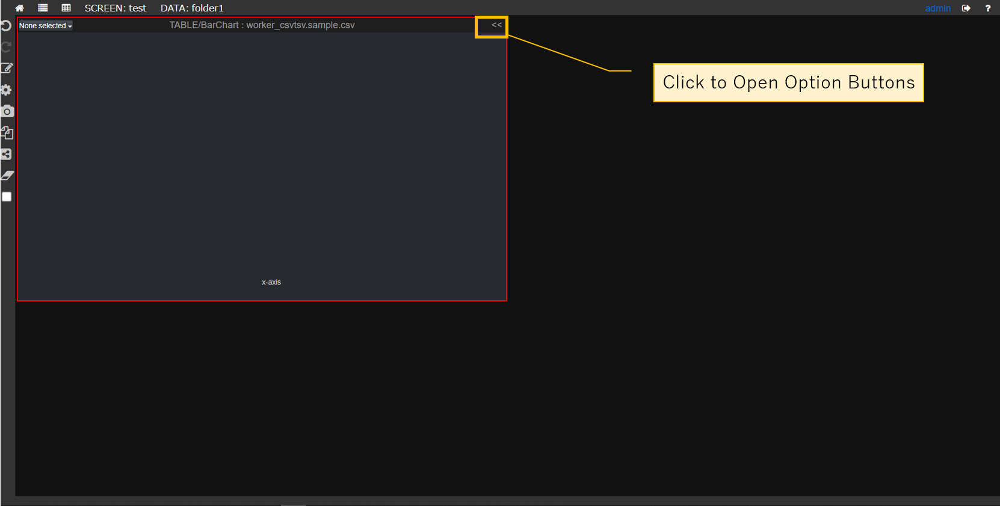

## TUTORIAL

1.Set a CSV File to server/backend/worker_csvtsv/data/

2.Access your polyspector server via chrome
```
 http://{your-server}:8888
```

3.Login


4.Select Data folder


5.Create Screen


6.Chart Selection


7.Data Selection


8.Open Option Buttons



9.Data Mapping


10.Color Mapping


